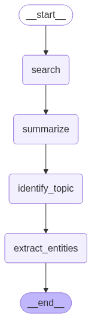
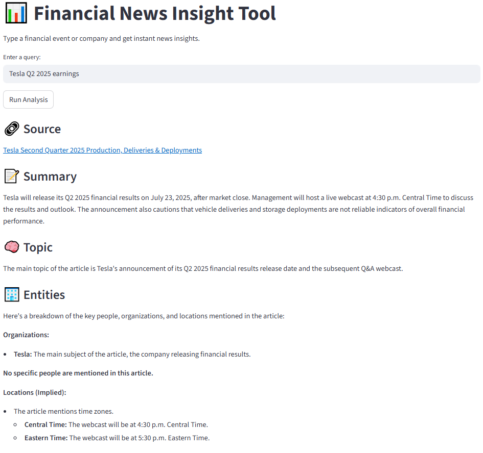

# Financial News Insight Tool

A lightweight web application that delivers **quick, structured insights** from financial news articles based on a **search query**.

This tool is designed for financial analysts and decision-makers who want to extract value from news rapidly using LLMs and agentic pipelines.

---

## Features

1. **Search** for relevant news using [Tavily Search](https://www.tavily.com/)
2. **Summarize**, **identify topic**, and **extract entities** (people, organizations, locations) using [LangGraph](https://github.com/langchain-ai/langgraph) + Gemini Pro
3. **Web-hosted** using [Streamlit Cloud](https://streamlit.io/cloud)

---

## How to Use

### A. Run Locally

1. Clone the repository:

   ```bash
   git clone https://github.com/yuansy/NewsSummary.git
   cd NewsSummary
   ```

2. Install dependencies:

   ```bash
   pip install -r requirements.txt
   ```

3. Create the `.streamlit/secrets.toml` file and add your API keys:

   ```toml
   # .streamlit/secrets.toml
   TAVILY_API_KEY = "your_tavily_api_key"
   GOOGLE_API_KEY = "your_google_api_key"
   ```

4. Launch the app:

   ```bash
   streamlit run app.py
   ```

---

### B. Try It Online (No Setup)

[Launch Web App](https://newssummaryquickproject.streamlit.app/)

Just enter a financial term like **"New COVID variant"** to begin.

---

## Tech Stack

| Component     | Technology         |
|---------------|--------------------|
| UI            | Streamlit          |
| LLM           | Google Gemini via LangChain |
| Pipeline Flow | LangGraph          |
| Web Search    | Tavily Search API  |
| Deployment    | Streamlit Cloud    |

---

## LangGraph Pipeline Design



---

## Example Query and Output




